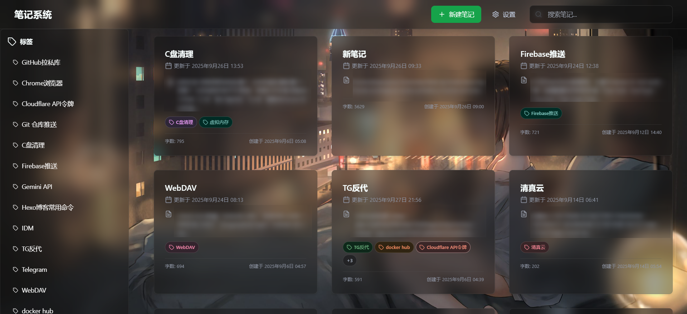

# 个人笔记系统

一个基于React + TypeScript + Cloudflare的现代化风格笔记应用，支持Markdown编辑、云同步

<p align="center">
  <a href="https://opensource.org/licenses/MIT">
    
  </a>
  <a href="https://reactjs.org/">
    
  </a>
  <a href="https://www.typescriptlang.org/">
    
  </a>
  <a href="https://vitejs.dev/">
    
  </a>
  <a href="https://pages.cloudflare.com/">
    
  </a>
  <a href="https://github.com/zxlwq/music">
    
  </a>
  <a href="https://hub.docker.com/r/zxlwq/music">
    
  </a>
</p>




## 🚀 技术栈

- **前端框架**: React 18 + TypeScript
- **构建工具**: Vite
- **样式框架**: Tailwind CSS + PostCSS
- **Markdown**: React Markdown
- **部署平台**: Cloudflare Pages
- **数据库**:  D1 SQL数据库

## Cloudflare Pages部署
- 框架预设：React (Vite)
- 添加环境变量

## 环境变量

- `PASSWORD`: 登录密码
- `WEBDAV_URL`: WebDAV 服务器地址
- `WEBDAV_USER`: WebDAV 用户名
- `WEBDAV_PASS`: WebDAV 密码


## 新建D1 SQL数据库建表SQL 语句

- `DB`: D1数据库绑定名称
  
```
CREATE TABLE IF NOT EXISTS settings (
  key TEXT PRIMARY KEY,
  value TEXT,
  updated_at TEXT
);

CREATE TABLE IF NOT EXISTS notes (
  id TEXT PRIMARY KEY,
  title TEXT,
  content TEXT,
  tags TEXT,
  created_at TEXT,
  updated_at TEXT
);

CREATE INDEX IF NOT EXISTS idx_notes_updated_at ON notes(updated_at);

CREATE TABLE IF NOT EXISTS logs (
  id INTEGER PRIMARY KEY,
  level TEXT,
  message TEXT NOT NULL,
  meta TEXT,
  created_at TEXT DEFAULT (datetime('now'))
);
CREATE INDEX IF NOT EXISTS logs_created_at_idx ON logs(created_at);

INSERT OR IGNORE INTO settings (key, value, updated_at)
VALUES ('password_set', 'false', datetime('now'));
```

## .github/workflows/backup.yml每日0点自动备份笔记
