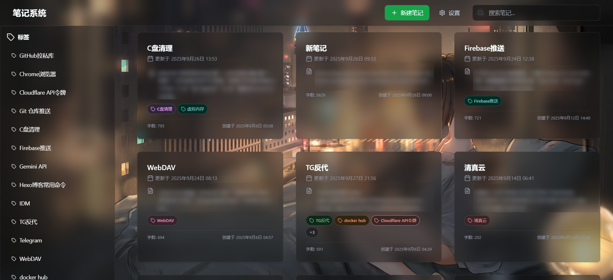
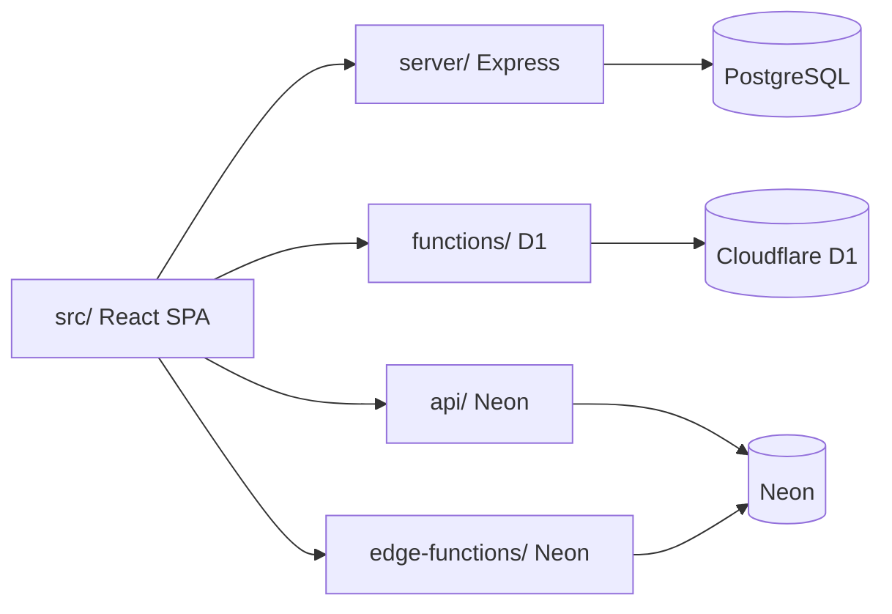

# 个人笔记系统

基于 React 的现代化 Markdown 笔记应用，支持客户端加密、多后端部署与多种云备份。

<p align="center">
  
</p>

<p align="center">
  <a href="https://reactjs.org/">
    
  </a>
  <a href="https://vitejs.dev/">
    
  </a>
  <a href="https://www.typescriptlang.org/">
    
  </a>
  <a href="https://github.com/zxlwq/notes">
    
  </a>
  <a href="https://pages.cloudflare.com/">
    
  </a>
  <a href="https://vercel.com/">
    
  </a>
  <a href="https://pages.edgeone.ai/">
    
  </a>
</p>



---

## 功能特性

| 类别 | 能力                                                                    |
| ---- | ----------------------------------------------------------------------- |
| 编辑 | SimpleMDE 编辑 + GFM 预览；详情页 `react-markdown` + 代码高亮 + Mermaid |
| 组织 | 标签、拖拽排序、高级搜索、列表分页与无限滚动                            |
| 安全 | 登录鉴权、客户端 AES-GCM 加密、JWT 会话                                 |
| 同步 | WebDAV / GitHub Gist / Cloudflare R2 备份                               |
| 体验 | PWA 离线壳、多标签页编辑冲突提示、移动端顶栏菜单                        |
| 部署 | Express、Vercel、Cloudflare Pages、EdgeOne Pages、Docker                |

---

## 技术栈

| 层级 | 选型                                                                      |
| ---- | ------------------------------------------------------------------------- |
| 前端 | React 18、TypeScript、Vite 7、Tailwind CSS                                |
| 编辑 | SimpleMDE（编辑）、react-markdown + remark-gfm + rehype-highlight（详情） |
| 后端 | Express + PostgreSQL；Serverless / Edge Functions 适配多平台              |
| 共享 | `shared/` 统一鉴权、笔记 CRUD、备份、分页、迁移逻辑                       |
| 离线 | vite-plugin-pwa：静态资源预缓存；`/api` 走 NetworkOnly（不缓存）          |

### PWA 与离线

| 项      | 行为                                                            |
| ------- | --------------------------------------------------------------- |
| 静态壳  | JS/CSS/HTML、图标等由 Service Worker 预缓存，可离线打开应用界面 |
| API     | `/api/*` 始终走网络（NetworkOnly），离线时无法加载/保存笔记     |
| 更新    | 小版本自动刷新；**主版本号**变更时底部提示条，用户确认后刷新    |
| Mermaid | 独立 chunk，仅在详情页遇到 ` ```mermaid ` 代码块时按需加载      |

---

## 项目结构

### 总览

```
notes/
├── src/                      # React 前端 SPA
├── shared/                   # 多后端共享业务逻辑（Node ESM）
├── server/                   # Express 后端（本地 / Docker / 自托管）
├── api/                      # Vercel Serverless Functions
├── functions/                # Cloudflare Pages Functions（D1）
├── edge-functions/           # EdgeOne / Hugging Face 边缘函数（Neon）
├── public/                   # 静态资源（构建时复制到 dist/）
├── .github/workflows/        # CI/CD（Docker、备份、HF Spaces）
├── index.html                # Vite 入口 HTML
├── vite.config.ts            # Vite + PWA 配置
├── docker-compose.yml
├── Dockerfile
├── vercel.json               # Vercel 路由与构建
├── edgeone.json              # EdgeOne Pages 配置
└── .env.example              # 环境变量模板
```

### 前端 `src/`

```
src/
├── main.tsx                  # 应用入口、PWA 注册、外观初始化
├── App.tsx                   # 路由与布局
├── index.css                 # 全局样式
├── vite-env.d.ts             # Vite / PWA 类型声明
│
├── pages/                    # 页面级组件（React Router）
│   ├── Login.tsx             # 登录 / 恢复码重置
│   ├── List.tsx              # 笔记列表、搜索、无限滚动
│   ├── View.tsx              # 笔记详情
│   ├── Edit.tsx              # 笔记编辑、多标签冲突检测
│
├── components/               # 业务组件
│   ├── Editor.tsx            # SimpleMDE 编辑器
│   ├── Editor.css
│   ├── Toolbar.tsx           # Markdown 格式工具栏
│   ├── Settings.tsx          # 设置弹窗（外观、备份、密码）
│   ├── Modal.tsx             # 通用 / 确认 / 输入 / 选择模态框
│   ├── Advanced.tsx          # 高级搜索（标题/标签/正文）
│   ├── Card.tsx              # 笔记卡片
│   ├── Mermaid.tsx           # Mermaid 图表渲染
│   ├── Protected.tsx         # 路由鉴权守卫
│   ├── BackTop.tsx           # 回到顶部
│   ├── Boundary.tsx          # 错误边界
│   │
│   ├── view/                 # 详情页子组件
│   │   ├── Bar.tsx           # 顶栏（移动端折叠菜单）
│   │   ├── Meta.tsx          # 标题、标签、时间元信息
│   │   └── Md.tsx            # Markdown 渲染（GFM + 高亮 + Mermaid）
│   │
│   ├── settings/             # 设置弹窗子模块
│   │   ├── Backup.tsx        # 导入 / 导出 / 云备份
│   │   ├── Pwd.tsx           # 改密 / 恢复码
│   │   ├── Recovery.tsx      # 恢复码一次性展示（复制 / 下载）
│   │   ├── Import.tsx        # 文件导入预览
│   │   ├── Logs.tsx          # 后端日志查看
│   │   └── logTr.ts          # 日志消息中文化
│   │
│   └── ui/                   # 通用 UI 原子组件
│       ├── Button.tsx
│       ├── Input.tsx
│       ├── Loading.tsx
│       └── Preload.tsx
│
├── lib/                      # 工具与 API 封装
│   ├── api.ts                # axios 客户端、notesApi / authApi / cloudApi
│   ├── crypto.ts             # AES-GCM 加解密（内存密钥）
│   ├── session.ts            # JWT 会话读写
│   ├── notes.ts              # 列表摘要缓存（session/localStorage）
│   ├── search.ts             # 客户端高级搜索（按需拉正文）
│   ├── markdown.ts           # GFM 预处理、编辑预览、rehype 插件
│   ├── backup.ts             # 导入导出格式转换
│   ├── reencrypt.ts          # 改密后全库重加密
│   ├── noteSync.ts           # 多标签页编辑锁 / BroadcastChannel
│   ├── listRefresh.ts        # 列表静默刷新间隔
│   ├── viewScroll.ts         # 详情页标签/高亮滚动
│   ├── utils.ts              # 通用工具（slugify、debounce 等）
│   └── webp.ts               # 背景图加载
│
├── hooks/
│   ├── Trap.ts               # 模态框焦点陷阱、Esc 关闭
│   ├── Modal.ts              # 模态框状态 hook
│   ├── Monitor.ts            # 性能/可见性监控
│   └── Storage.ts            # localStorage 封装
│
├── contexts/
│   └── Context.tsx           # 认证 Context（登录态、解锁）
│
└── types/
    └── index.ts              # Note、AppSettings、API 类型
```

### 共享层 `shared/`

四套后端共用的纯 Node 逻辑：

```
shared/
├── auth-node.js              # checkAuth（Cookie / Bearer JWT）
├── session.js                # JWT 签发/校验、恢复码哈希
├── notes.js                  # 笔记 DTO 映射、导入规范化
├── sql.js                    # PostgreSQL SQL 语句常量
├── pg-notes.js               # Express pool 笔记 CRUD + 分页
├── neon-notes.js             # Neon tagged-template 笔记 CRUD + replaceAllNotes
├── d1-notes.js               # Cloudflare D1 笔记 CRUD + 分页
├── d1-migrate.js             # D1 schema_migrations / 索引
├── d1-logRet.js              # D1 logs 过期清理
├── webdav.js                 # WebDAV 备份拉取/上传
├── gist.js                   # GitHub Gist API（fetch，四后端共用）
├── gist-store.js             # gist_id 存储（PG / D1 / Neon）
├── r2.js                     # R2 S3 签名与上传/下载
├── pagination.js             # page/limit 解析与响应封装
├── backup.js                 # Markdown ↔ JSON 备份解析
├── migrate.js                # schema_migrations 版本迁移
├── cors.js                   # CORS 解析（ALLOWED_ORIGINS / Origin 回显）
├── d1-pg-sync.js             # Cloudflare D1 → PostgreSQL 跨平台同步
├── logRet.js                 # logs 表过期清理
└── util.js                   # safeJsonParse 等工具
```

### Express 后端 `server/`

```
server/
├── index.js                  # Express 入口、CSP/HTTPS、静态 dist
├── context.js                # 数据库连接、initDatabase、鉴权中间件
├── routes/
│   ├── auth.js               # 登录、改密、恢复码、会话
│   ├── notes.js              # 笔记 CRUD + 分页
│   ├── backup.js             # WebDAV 备份
│   ├── gist.js               # GitHub Gist 备份
│   ├── r2.js                 # Cloudflare R2 备份
│   ├── order.js              # 笔记/标签排序持久化
│   └── logs.js               # 日志查询与清空
└── services/
    ├── gist.js               # Gist API 调用
    └── r2.js                 # R2 S3 兼容 API 调用
```

### Vercel `api/`

文件路径即 HTTP 路由（Neon + `shared/` 薄适配）：

```
api/
├── _utils/                   # auth、pg 连接、session
├── _services/                # gist/r2 备份（对齐 server/services）
├── login.js / logout.js / session.js
├── password.js / password/status.js
├── recovery/status.js / setup.js / reset.js
├── notes.js / notes/[id].js
├── import.js / logs.js
├── backup.js / gist.js / r2.js
└── order/[key].js
```

### Cloudflare Pages `functions/`

TypeScript Workers 风格，绑定 D1（`NOTESD`）：

```
functions/
├── types.ts
├── _utils/                   # auth、log、session
└── api/                      # 与 Vercel 路由一一对应
    ├── notes.ts / notes/[id].ts
    ├── login.ts / backup.ts / gist.ts / r2.ts
    └── recovery/ …
```

### EdgeOne / HF `edge-functions/`

Neon 数据库 + 与 `api/` 同构的路由：

```
edge-functions/
├── _utils/
│   ├── auth.js / session.js
│   ├── log.js
│   └── logger.js             # 生产环境 trace() 静默日志
├── services/
│   ├── neonNotes.js          # 重导出 shared/neon-notes（兼容旧引用）
│   ├── gist.js               # Gist 备份/恢复（Neon）
│   └── r2.js                 # R2 备份/恢复（Neon）
└── api/                      # 路由结构同 api/，薄 HTTP 适配
```

### CI

```
.github/workflows/
├── docker.yml                # Docker 镜像构建推送
├── backup.yml                # 定时备份
└── notes-api.yml             # Hugging Face Spaces 部署
```

### 架构

前端为统一 SPA，按部署目标对接不同 API 目录：


```mermaid
flowchart LR
    FE["src/ React SPA"]

    FE --> Local["server/ Express"]
    FE --> CF["functions/ D1"]
    FE --> Vercel["api/ Neon"]
    FE --> EO["edge-functions/ Neon"]

    Local --> PG[(PostgreSQL)]
    Vercel --> Neon[(Neon)]
    EO --> Neon
    CF --> D1[(Cloudflare D1)]
```

| 目录              | 适用平台                                 |
| ----------------- | ---------------------------------------- |
| `server/`         | 本地开发、Docker、Render、Koyeb 等自托管 |
| `api/`            | Vercel                                   |
| `functions/`      | Cloudflare Pages                         |
| `edge-functions/` | EdgeOne Pages、Hugging Face Spaces       |

四套后端均复用 `shared/`，保证笔记、备份、鉴权行为一致。

---

## 客户端加密

启用加密后，标题、正文、标签在浏览器端 AES-GCM 加密后上传，服务端仅存密文。

- 加密密码仅存于页面内存（`src/lib/crypto.ts`），刷新或关闭标签页后需重新输入以解锁
- 登录密码与加密密码可相同（登录时自动写入内存密钥）
- **改密码**：设置中修改密码会触发全库重加密，完成后需重新登录；请保持网络稳定
- 历史明文笔记在首次打开时自动迁移为密文

### 搜索与索引

笔记启用加密后，**服务端无法对正文做全文检索**（库中仅为密文）。搜索在浏览器本地完成：

- 解锁后后台将解密后的标题/标签/正文写入 **IndexedDB**（`src/lib/searchIdx.ts`），避免每次搜索逐条 `GET /api/notes/:id`
- 首次进入列表或搜索时会预热索引；保存/删除笔记会同步更新索引
- 退出登录会清空本地搜索索引
- 搜索结果支持分页（`searchNotesPaged`）；正文建议项带 **snippet** 摘要

未加密部署理论上可在服务端做 FTS，但当前产品以客户端索引为主，与 E2E 加密模型一致。

---

## 忘记密码 / 恢复码

在设置 → 密码面板中可生成一次性恢复码（格式 `XXXX-XXXX-XXXX-XXXX`）。生成后请立即复制或下载 `.txt` 保存，关闭弹窗后无法再次查看。

| 步骤    | 说明                                                  |
| ------- | ----------------------------------------------------- |
| 1. 生成 | 设置 → 修改密码 →「生成恢复码」；重新生成会使旧码失效 |
| 2. 保存 | 复制到剪贴板或下载 `.txt`，离线妥善保管               |
| 3. 重置 | 登录页「忘记密码？使用恢复码」→ 输入恢复码与新密码    |

**重要限制**：恢复码仅能重置**登录密码**（服务端 `PASSWORD` / 数据库中的密码哈希）。客户端 AES 加密密钥随页面内存丢失，若未在改密前解锁并完成重加密，**已加密笔记内容无法通过恢复码找回**。

### 备份格式

| 格式     | 说明                                                                    |
| -------- | ----------------------------------------------------------------------- |
| JSON     | 完整对象数组（`id`、`title`、`content`、`tags`、时间戳），导入/导出推荐 |
| Markdown | 以 `---` 分隔，含 YAML 元数据                                           |
| 纯文本   | 仅标题与正文                                                            |

WebDAV / Gist / R2 云端备份均使用 JSON。

---

## 本地开发

### 环境要求

- Node.js 20+
- PostgreSQL 15+（或 Docker 启动数据库）

### 快速开始

```bash
git clone https://github.com/zxlwq/notes.git
cd notes
npm install
cp .env.example .env   # 填写 PASSWORD、DATABASE_URL
```

启动数据库（Docker 示例）：

```bash
docker compose up postgres -d
```

双终端开发：

```bash
# 终端 1：后端 http://localhost:3000
npm run dev:server

# 终端 2：前端 http://localhost:5173（/api 代理至后端）
npm run dev
```

> 后端启动时会自动建表、执行 `shared/migrate.js` 版本迁移，并按 `LOG_RETENTION_DAYS`（默认 30 天）清理过期日志。

### 常用命令

| 命令                 | 说明                                 |
| -------------------- | ------------------------------------ |
| `npm run dev`        | Vite 前端开发服务器                  |
| `npm run dev:server` | Express 后端（读取 `.env`）          |
| `npm run build`      | 构建前端至 `dist/`                   |
| `npm run preview`    | 预览构建产物                         |
| `npm start`          | 生产模式后端（需先 `build`）         |
| `npm run check`      | 类型 + ESLint + Stylelint + Prettier |

### Docker 一键部署

```bash
docker compose up -d
```

应用默认 `http://localhost:3000`（内置 PostgreSQL + Express）。

---

## API 摘要

| 方法            | 路径                         | 说明                                                    |
| --------------- | ---------------------------- | ------------------------------------------------------- |
| GET             | `/api/notes`                 | 笔记摘要列表（不含正文）                                |
| GET             | `/api/notes?page=1&limit=30` | 分页列表，返回 `{ items, total, page, limit, hasMore }` |
| GET             | `/api/notes/:id`             | 单条笔记（含正文）                                      |
| POST/PUT/DELETE | `/api/notes`                 | 创建 / 更新 / 删除                                      |
| POST            | `/api/import`                | 批量导入                                                |
| GET/POST        | `/api/backup`                | WebDAV 云备份                                           |
| GET/POST        | `/api/gist`                  | GitHub Gist 备份                                        |
| GET/POST        | `/api/r2`                    | Cloudflare R2 备份                                      |
| POST            | `/api/login`                 | 登录，返回 JWT                                          |
| POST            | `/api/logout`                | 退出登录                                                |
| GET             | `/api/session`               | 查询当前会话是否有效                                    |
| POST            | `/api/password`              | 修改登录密码（需已登录）                                |
| GET             | `/api/password/status`       | 密码存储来源（env / D1 / PostgreSQL）                   |
| GET             | `/api/recovery/status`       | 是否已配置恢复码                                        |
| POST            | `/api/recovery/setup`        | 生成恢复码（一次性返回明文，需已登录）                  |
| POST            | `/api/recovery/reset`        | 用恢复码重置密码（无需登录；有速率限制）                |
| GET             | `/api/sync`                  | 查询 D1→PostgreSQL 同步是否已配置（Cloudflare Pages）   |
| POST            | `/api/sync`                  | 手动全量同步 D1 至 `DATABASE_URL`（需已登录）           |

所有写操作需携带有效会话（`Authorization: Bearer <token>` 或 Cookie）。`/api/login` 与 `/api/recovery/reset` 除外。

---

## 多平台部署

| 平台                | 数据库     | API 目录          | 必填配置                                             |
| ------------------- | ---------- | ----------------- | ---------------------------------------------------- |
| Cloudflare Pages    | D1         | `functions/`      | `PASSWORD` + 绑定 `NOTESD`；可选 `DATABASE_URL` 同步 |
| Vercel              | Neon       | `api/`            | `PASSWORD` + `DATABASE_URL`                          |
| EdgeOne Pages       | Neon       | `edge-functions/` | `PASSWORD` + `DATABASE_URL`                          |
| Hugging Face Spaces | Neon       | `edge-functions/` | GitHub Actions 注入 env                              |
| Docker / 自托管     | PostgreSQL | `server/`         | `PASSWORD` + `DATABASE_URL`                          |

### Cloudflare Pages

1. Fork 仓库，创建 D1 数据库 `notes`
2. 执行建表 SQL（见下方）
3. Pages 绑定 D1，名称 `NOTESD`
4. 设置环境变量 `PASSWORD`，部署
5. **（可选）跨平台同步**：在 [Neon](https://neon.tech/) 或自托管 PostgreSQL 创建数据库，将连接串写入 Pages 环境变量 `DATABASE_URL`。D1 仍为读写主库；笔记、密码设置、排序等变更会异步同步至 PostgreSQL。迁移到 Vercel / Docker 时复用同一 `DATABASE_URL` 即可保留数据

```sql
CREATE TABLE IF NOT EXISTS settings (
  key TEXT PRIMARY KEY, value TEXT, updated_at TEXT
);
CREATE TABLE IF NOT EXISTS notes (
  id TEXT PRIMARY KEY, title TEXT, content TEXT, tags TEXT,
  created_at TEXT, updated_at TEXT
);
CREATE TABLE IF NOT EXISTS logs (
  id INTEGER PRIMARY KEY, level TEXT, message TEXT NOT NULL,
  meta TEXT, created_at TEXT DEFAULT (datetime('now'))
);
CREATE TABLE IF NOT EXISTS order_data (
  key TEXT PRIMARY KEY, value TEXT, updated_at TEXT DEFAULT (datetime('now'))
);

-- 性能索引（也可由 API 首次访问时通过 shared/d1-migrate.js 自动创建）
CREATE INDEX IF NOT EXISTS idx_notes_updated_at ON notes(updated_at DESC);
CREATE INDEX IF NOT EXISTS idx_logs_created_at ON logs(created_at DESC);
```

R2 备份：在 Pages 绑定 R2 桶，名称 `NOTESR`。

**同步说明**：配置 `DATABASE_URL` 后，写操作（增删改笔记、导入、云备份恢复、改密等）会通过 `waitUntil` 异步推送全量快照至 PostgreSQL。也可调用 `POST /api/sync` 手动触发。同步范围：`notes`、`settings`（含密码哈希/恢复码）、`order_data`（不含 `logs`）。

- **冲突策略**：以 **D1 为唯一写入源**；PG 仅接收 D1 全量快照，同 id/key 行被覆盖，D1 中已删行在 PG 侧同步删除。
- **失败重试**：后台同步失败时自动重试最多 3 次（指数退避）；仍失败则打日志，可 `POST /api/sync` 手动补偿。

**日志 Cron**：仓库根目录 [`wrangler.toml`](wrangler.toml) 含 Cron 示例（`0 3 * * *` → `functions/scheduled/logs.ts`）。Dashboard 路径：Workers & Pages → 项目 → Settings → Functions → Cron triggers；需绑定 `NOTESD` 与可选 `LOG_RETENTION_DAYS`。

### Vercel

1. 创建 Neon 数据库，获取 `DATABASE_URL`
2. 导入仓库，配置 `PASSWORD`、`DATABASE_URL`
3. 部署

### EdgeOne Pages

1. 创建 [Neon](https://neon.tech/) 数据库
2. 连接 GitHub 仓库，配置 `PASSWORD`、`DATABASE_URL`
3. 部署

### Hugging Face Spaces

使用 [.github/workflows/notes-api.yml](.github/workflows/notes-api.yml) 通过 GitHub Actions 创建 Docker Space，并注入 `PASSWORD`、`JWT_SECRET`、`DATABASE_URL` 等环境变量（生产环境 `JWT_SECRET` 必填，与登录密码独立）。

---

## 环境变量

完整示例见 [.env.example](.env.example)。

| 变量                   | 必填   | 说明                                                             |
| ---------------------- | ------ | ---------------------------------------------------------------- |
| `PASSWORD`             | ✅     | 登录密码（所有平台）                                             |
| `DATABASE_URL`         | ✅\*   | PostgreSQL / Neon 连接串；Cloudflare Pages 可选，用于 D1→PG 同步 |
| `JWT_SECRET`           | ✅\*\* | 会话 JWT 签名密钥（独立随机串，**勿与 `PASSWORD` 相同**）        |
| `SESSION_TTL_SEC`      | ❌     | 会话/JWT 有效期（秒），默认 604800（7 天）                       |
| `ALLOWED_ORIGINS`      | ❌     | 生产 CORS 白名单（逗号分隔）；未设置则回显 Origin                |
| `LOG_RETENTION_DAYS`   | ❌     | Express 日志保留天数，默认 30                                    |
| `DEBUG`                | ❌     | Edge 函数调试日志（`true` 开启）                                 |
| `WEBDAV_URL/USER/PASS` | ❌     | WebDAV 备份                                                      |
| `GIT_TOKEN`            | ❌     | GitHub Gist 备份                                                 |
| `ACCOUNT_ID` 等        | ❌     | R2 备份（Cloudflare Pages 可改绑 `NOTESR`）                      |

> \* Vercel / EdgeOne / Docker 必填 `DATABASE_URL`。Cloudflare Pages 默认用 D1 绑定 `NOTESD`；若需跨平台迁移，额外配置 `DATABASE_URL` 启用同步。
>
> \*\* 生产环境（`NODE_ENV=production`）四后端均强制 `JWT_SECRET`；本地开发可省略，将临时用 `PASSWORD` 签名（不推荐用于生产）。

---

## 运维说明

- **数据库迁移**
  - Express / Vercel（PostgreSQL）：`shared/migrate.js` 维护 `schema_migrations`，Express 启动或 Vercel Cron 执行时自动建索引
  - Cloudflare D1：`shared/d1-migrate.js` 与 PG 版索引对齐；首次笔记/日志 API 访问时自动执行，建表 SQL 见上文 Cloudflare 章节
- **日志清理**（默认保留 30 天，可通过 `LOG_RETENTION_DAYS` 调整）
  - Express：启动时调用 `shared/logRet.js`
  - Vercel Cron：每日 03:00 请求 `/api/cron/logs`（建议设置 `CRON_SECRET`）
  - Cloudflare Pages Cron：`wrangler.toml` 示例 + Dashboard Cron triggers → `functions/scheduled/logs.ts`；或已登录时 `POST /api/logs` 手动清理
  - 设置页仍可手动清空全部日志
- **生产安全（可选）**
  - CORS：四后端统一 `shared/cors.js`；设 `ALLOWED_ORIGINS=https://你的域名` 限制跨域
  - 会话：Cookie `SameSite=Strict` + HttpOnly；JWT 支持 `SESSION_TTL_SEC` 缩短有效期
  - 限流：登录/恢复码为进程内滑动窗口；多实例不共享，高流量可接 Redis 或 [Cloudflare Rate Limiting](https://developers.cloudflare.com/waf/rate-limiting-rules/)
- **Edge 日志**：生产环境默认静默，设 `DEBUG=true` 或 `ENVIRONMENT=development` 开启

---

## 如果您喜欢这个项目，请给一个 ⭐ 星标！
